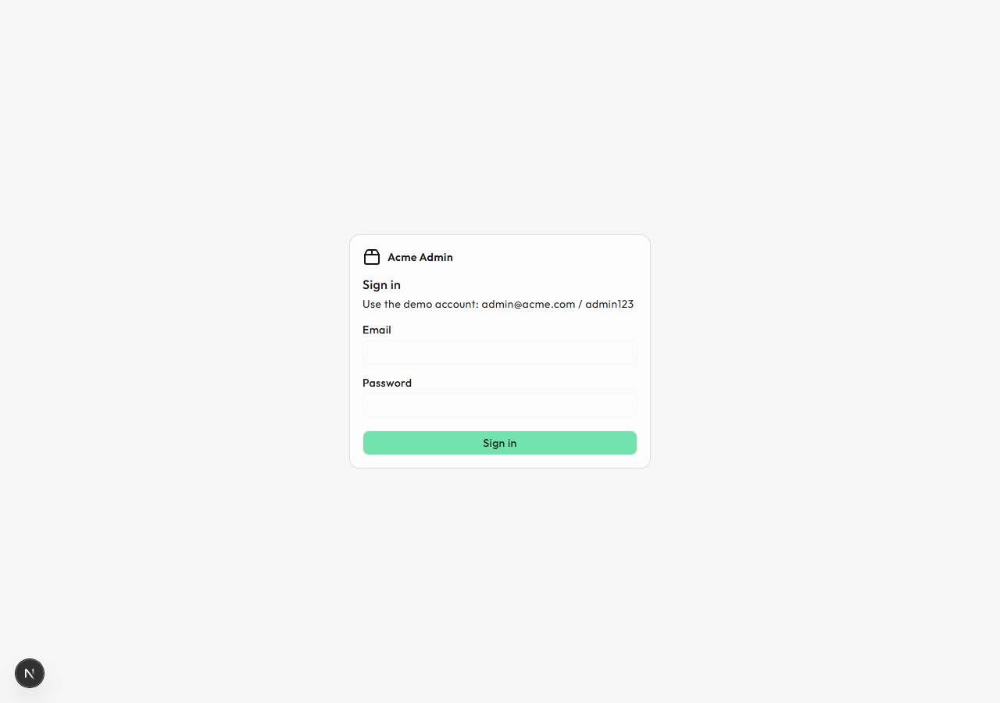
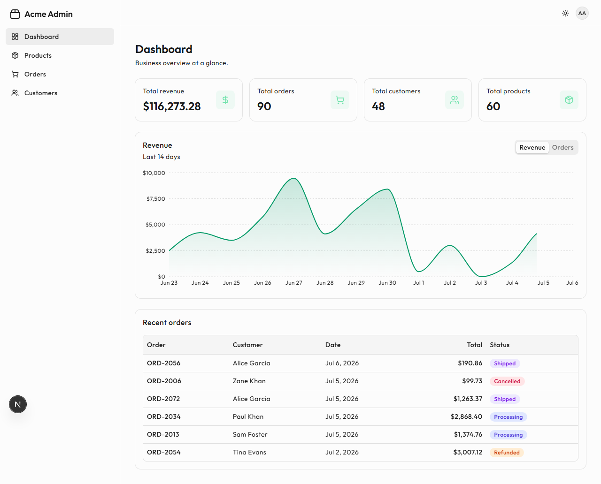
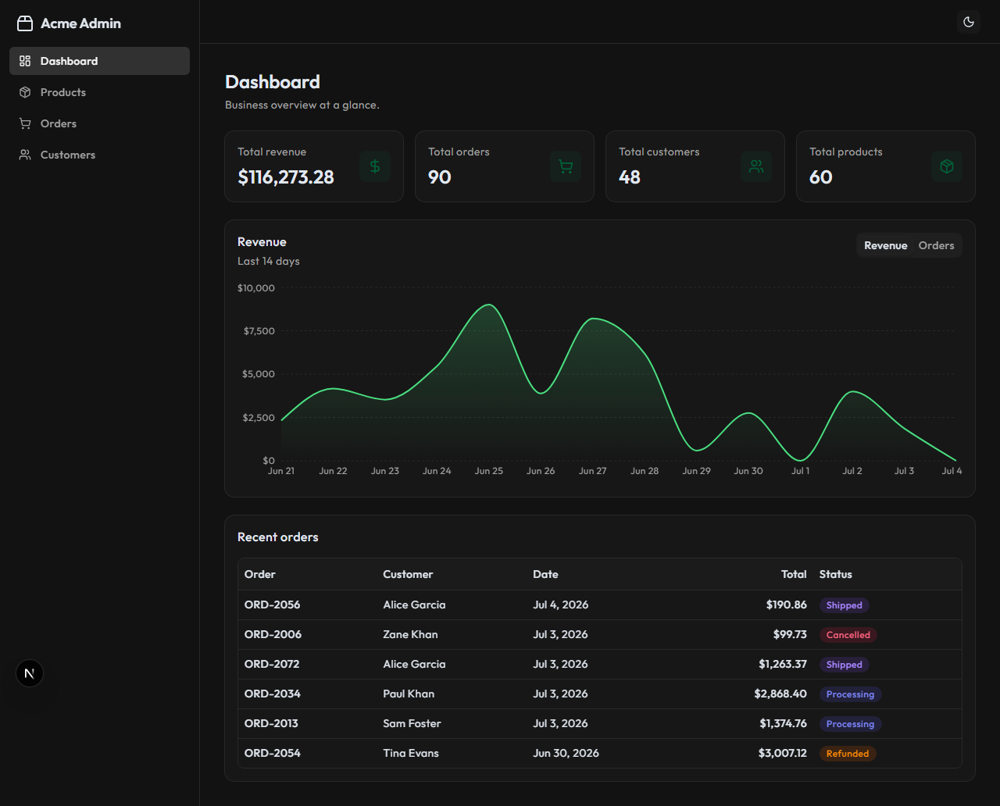
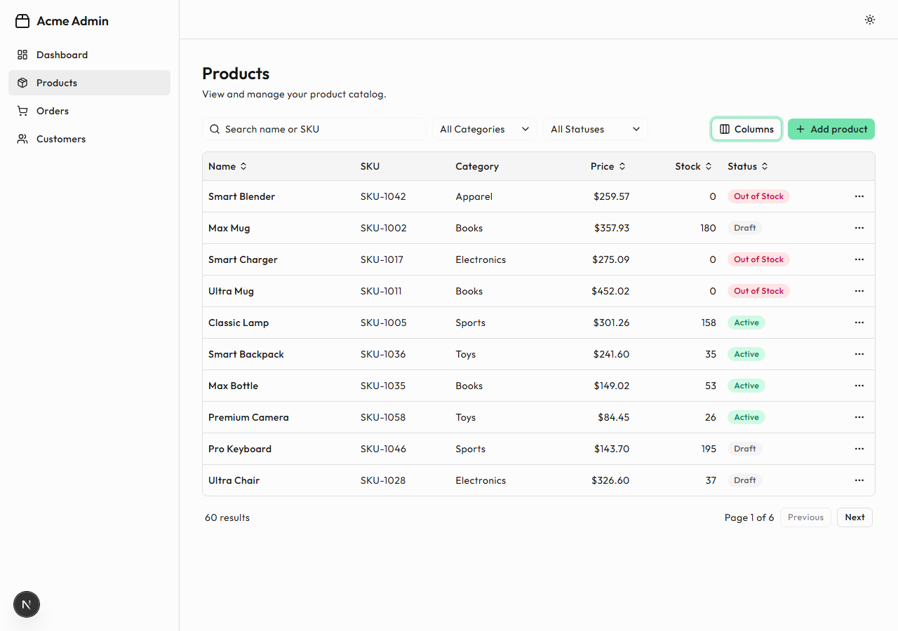
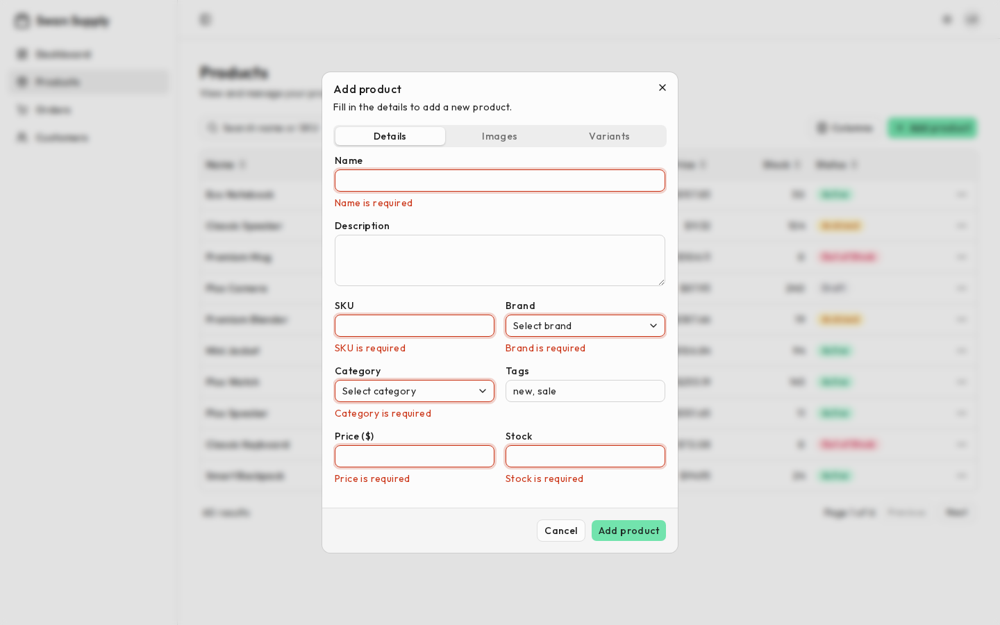
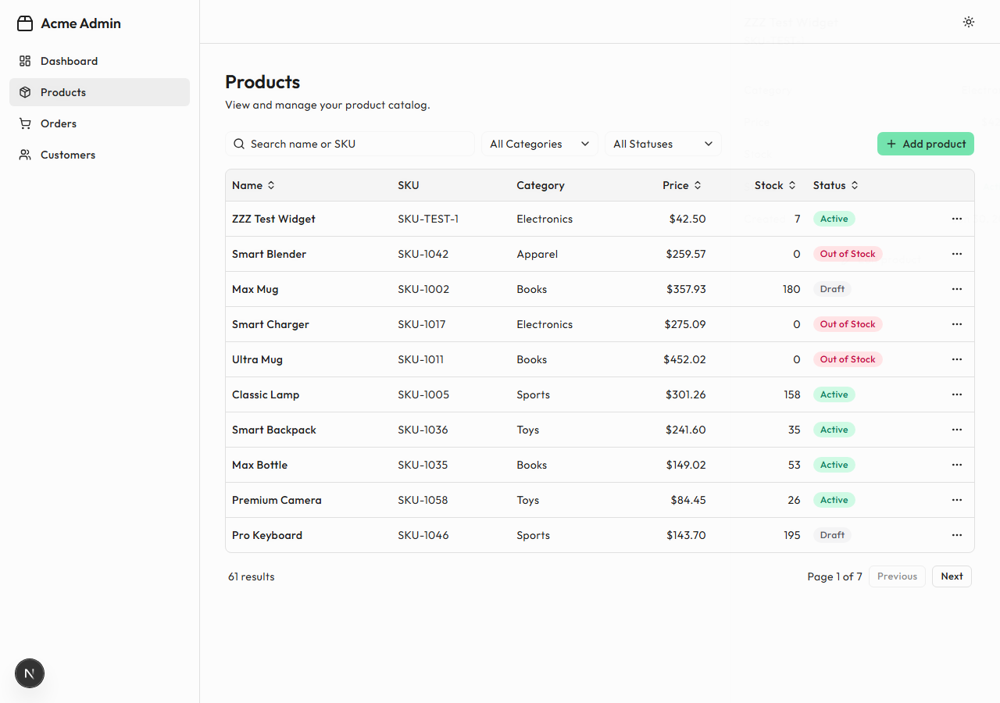
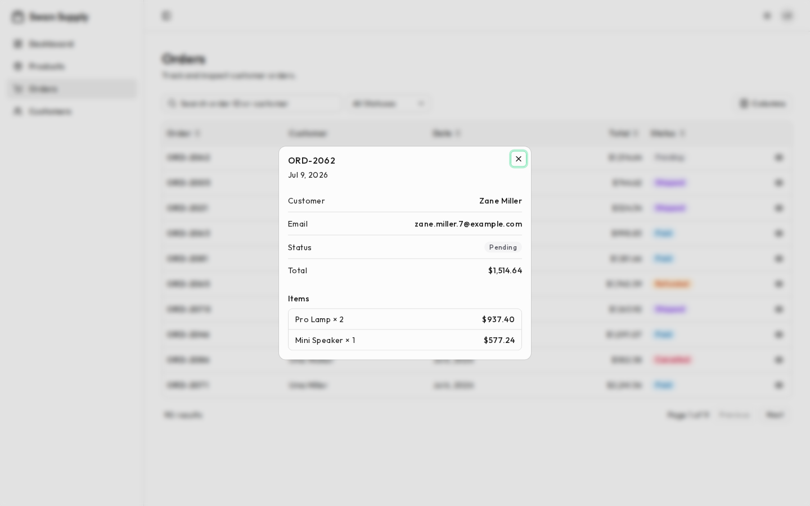
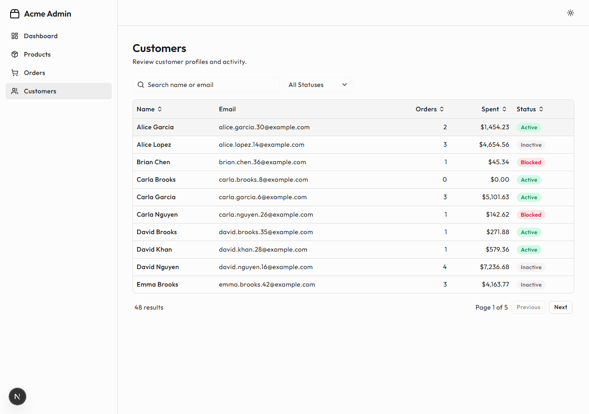
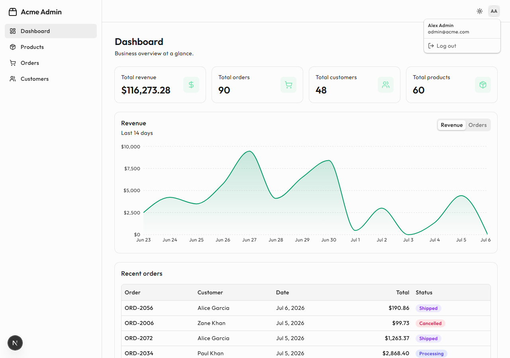
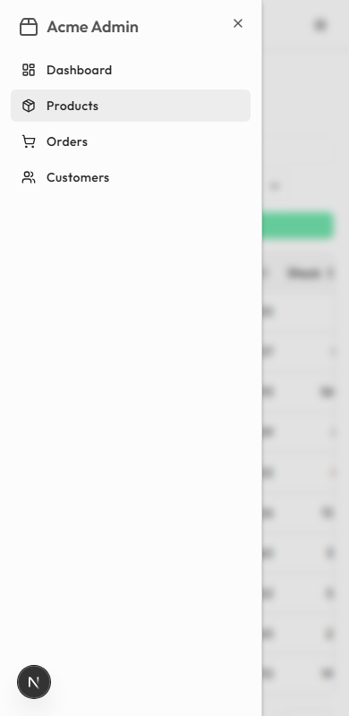

# Ecommerce Admin Panel

An internal admin panel for store staff to monitor performance and manage
products, orders, and customers — behind a session-based login. Built with the
Next.js App Router, TypeScript, and a shadcn/ui component layer.

The app is **server-first**: pages are React Server Components that read the
URL and query the data on the server, mutations are Server Actions, and the
client components only handle interactivity (dialogs, menus, optimistic
updates). The data itself is a mocked in-memory dataset, but the wiring —
httpOnly session cookie, middleware-guarded routes, URL-driven
search/filter/sort/pagination — is the production pattern.

## Tech stack

| Tool | Why |
| --- | --- |
| **Next.js 16 (App Router) + TypeScript** | Server components, Server Actions, route groups, middleware (`proxy.ts`), `loading`/`error` file conventions. |
| **Tailwind CSS + shadcn/ui** | Accessible components copied *into* the repo (built on Base UI primitives), so they're owned and editable, not a black box. |
| **TanStack Table (headless)** | Column definitions, sorting state, column visibility — logic only, we own all the markup. |
| **React Hook Form + Zod** | One schema validates the product form on the client *and* the Server Action input on the server. |
| **Session auth (no library)** | HMAC-signed tokens in an httpOnly cookie, verified in middleware — small enough to own and explain. |
| **next-themes + Sonner** | Dark mode and toast notifications. |
| **Recharts** | The dashboard revenue/orders chart. |
| **Vitest + Testing Library** | Unit tests for utilities and component tests for the table and form. |

## Getting started

```bash
npm install
npm run dev      # http://localhost:3000
```

Sign in with the demo account:

```
email:    admin@acme.com
password: admin123
```

Other scripts:

```bash
npm run build    # production build
npm run start    # serve the production build
npm run test     # run unit + component tests (Vitest)
npm run lint     # ESLint
```

## How data flows

Reads — the URL is the single source of truth, and the server does the work:

```
/products?search=mug&status=active&sort=price&page=2
   │
   ▼
page.tsx (server component) ──▶ await searchParams
                            ──▶ parseListQuery()  validates/clamps the params
                            ──▶ queryList()       search → filter → sort → paginate
                            ──▶ <ProductsView data={...} />   props, already resolved
```

Changing a filter calls `router.replace` with the new query string (inside a
`useTransition`, so the table can show a pending state) — Next re-renders the
server component with the new `searchParams` and streams the result in. No
client-side fetching, no cache to keep in sync.

Writes — Server Actions:

```
form submit ──▶ createProduct()/updateProduct() ("use server")
                  ├─ session check (unauthorized → error)
                  ├─ Zod safeParse of the input
                  ├─ mutate the in-memory dataset
                  └─ revalidatePath("/products")  → fresh list in the same round trip
```

Archiving goes one step further with React 19's `useOptimistic`: the row flips
to "Archived" instantly, and if the action fails, the optimistic state reverts
automatically.

## Authentication

Session-based auth built from primitives (deliberately no auth library, so
every step is explainable):

```
login form ──▶ login() Server Action ──▶ validates credentials (Zod + mock user)
                                     └─▶ sets httpOnly session cookie (HMAC-signed token)
                                     └─▶ redirect("/dashboard")

every request ──▶ proxy.ts (middleware) ──▶ verifies the token signature + expiry
                                         ├─ no session          → redirect /login
                                         └─ has session + /login → redirect /dashboard

logout() Server Action ──▶ deletes the cookie ──▶ redirect("/login")
```

Security decisions worth noting:

- **httpOnly cookie** — client JavaScript can't read the session, so XSS can't
  steal it. `sameSite: "lax"` mitigates CSRF; `secure` in production.
- **Signed tokens** — the cookie value is `payload.signature` where the
  signature is an HMAC (server secret). Users can see their token but can't
  forge or alter it — tampering breaks the signature (covered by unit tests).
- **Defense in depth** — `proxy.ts` guards every route, the admin layout
  re-checks the session before rendering, and every Server Action re-checks it
  before mutating.

## Project structure

```
src/
  proxy.ts                # middleware: auth gate for every route
  app/
    layout.tsx            # root layout: fonts, providers
    page.tsx              # "/" -> redirects to /dashboard
    providers.tsx         # client context: theme, tooltips, toaster
    not-found.tsx         # 404 page
    (auth)/               # route group: pages outside the admin shell
      layout.tsx          #   centered card layout
      login/              #   login page + form (calls the login Server Action)
    (admin)/              # route group: everything behind auth
      layout.tsx          #   reads the session, wraps pages in the AppShell
      loading.tsx         #   route-level loading UI (Suspense file convention)
      error.tsx           #   route-level error boundary with retry
      dashboard/          #   page.tsx (server: computes stats) + dashboard-view.tsx
      products/           #   page.tsx (server: queries the list) + products-view.tsx
      orders/             #   page.tsx + orders-view.tsx
      customers/          #   page.tsx + customers-view.tsx
  components/
    layout/               # sidebar, header, app-shell, user-menu, theme-toggle
    tables/               # data-table, pagination, search, filter, column-toggle
    products/             # product-form-dialog (add/edit)
    dashboard/            # sales-chart (revenue/orders metric chart)
    ui/                   # shadcn/ui primitives (untouched)
  hooks/
    use-query-params.ts   # read/write URL search params (single source of truth)
    use-data-table.ts     # TanStack Table instance wired to the URL sort state
    use-debounced-value.ts
  lib/
    session.ts            # HMAC-signed session tokens (create/verify)
    auth.ts               # demo user + server-side session lookup
    auth-actions.ts       # login/logout Server Actions
    product-actions.ts    # create/update/archive Server Actions
    query.ts              # shared search/filter/sort/paginate engine
    dashboard-data.ts     # dashboard summary (totals, daily stats, recent orders)
    product-schema.ts     # Zod schemas (form values + action input)
  data/mock-data.ts       # seeded in-memory dataset
  types/                  # domain models
```

## State management

Four kinds of state, each held where it belongs:

1. **URL search params = filter/search/sort/page state.** A filtered table view
   is navigation state: it survives refresh, is shareable, and works with the
   back button (`/products?search=mug&status=active&sort=price&page=2`). A
   small hook ([`useQueryParams`](src/hooks/use-query-params.ts)) wraps Next's
   URL hooks; the search box, filters, sort headers, and pagination all read
   and write through it.
2. **Server data stays on the server.** Pages are server components that query
   per request — there is no client fetching layer or client cache to
   invalidate. After a mutation, `revalidatePath` refreshes the affected pages;
   while a filter change is in flight, `useTransition`'s `isPending` drives the
   table's loading state. Archive layers `useOptimistic` on top for instant
   feedback with automatic rollback.
3. **Session = an httpOnly cookie**, read server-side (middleware, layout,
   actions), never client JavaScript.
4. **Local `useState` = ephemeral UI.** Open drawer/dialog, hidden table
   columns, the chart's metric tab.

No global store — there's no cross-page client state that would justify one.

## Concepts demonstrated

- Server components reading `await searchParams` and querying data per request
- Server Actions (`login`, `logout`, product create/update/archive) with
  `revalidatePath` — mutation and fresh data in one round trip
- Optimistic UI with React 19 `useOptimistic` (instant flip, automatic rollback)
- `useTransition` to surface the server round trip as a pending state
- Route groups with separate layouts — `(auth)` vs `(admin)`
- Middleware auth gating (`proxy.ts`); HMAC-signed session tokens
  (tamper-proof, expiring, unit-tested)
- Route-level `loading.tsx`, `error.tsx` (error boundary + reset), `not-found.tsx`
- URL-driven table state (search/filter/sort/pagination as query params)
- Headless table with TanStack Table in **manual mode** — the server sorts,
  filters, and paginates; the table only manages view state (column
  definitions, sort indicators, column visibility)
- Validation at every trust boundary: URL params parsed and clamped, form
  values and Server Action inputs Zod-validated, session re-checked per action
- One generic engine (`queryList<T>`) and one generic table renderer
  (`DataTable<T>`) shared by all three resources
- Component + unit testing (Testing Library, 23 tests)

## Accessibility

- Dialogs, drawers, and menus are keyboard-accessible (focus trap, Esc) via the
  underlying primitives.
- Semantic `<table>` markup; sortable headers are real `<button>`s.
- All form fields have labels; invalid fields set `aria-invalid` with visible
  messages; the login error uses `role="alert"`.
- Visible focus rings; active nav sets `aria-current="page"`; empty/error
  states use `role="status"`.

## Assumptions & trade-offs

- **Mock backend is in-memory** — a server restart resets data. Auth is a
  demo: one hardcoded user, plaintext comparison; a real app would hash
  passwords and store sessions/users in a database. The *mechanics* (signed
  httpOnly cookie, middleware gate) are the production pattern.
- **`SESSION_SECRET`** falls back to a dev value; set the env var in production.
- **React Compiler is off** — TanStack Table mutates one stable `table`
  instance instead of creating new objects, so the compiler's auto-memoization
  never sees it "change" and the table UI goes stale. Documented in
  `next.config.ts`.
- **Detail views reuse the already-queried row** instead of a detail request —
  the list returns full objects, so the drawer opens instantly.
- **Create/edit rely on `revalidatePath`; archive is optimistic.** Both
  strategies shown deliberately: revalidate is simpler and always consistent;
  optimistic gives instant feedback and needs rollback (which `useOptimistic`
  handles for free).
- **Filter changes use `router.replace`** so typing doesn't spam history.
- **Column visibility is local state, not URL state** — a personal view
  preference, unlike filters which describe the data and belong in the URL.
- **Archive instead of delete** — safer for a catalog.
- **Chart colors were contrast-validated** — light mode's chart line uses a
  darker emerald step because the theme's pale mint fails 3:1 on white.

## Screenshots

| | |
| --- | --- |
| Login |  |
| Dashboard |  |
| Dashboard (dark) |  |
| Products |  |
| Add product — validation |  |
| Product detail drawer |  |
| Order detail |  |
| Customers |  |
| User menu |  |
| Mobile navigation |  |
